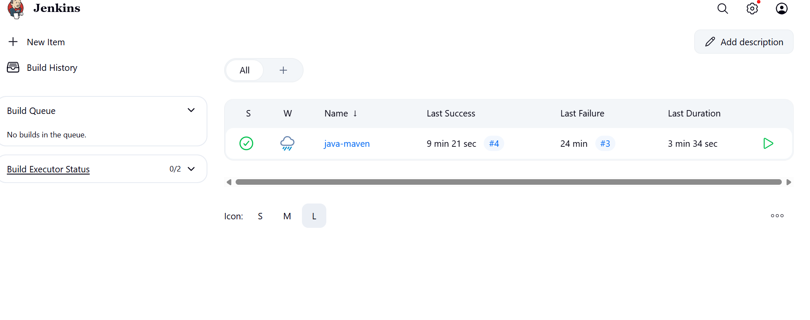
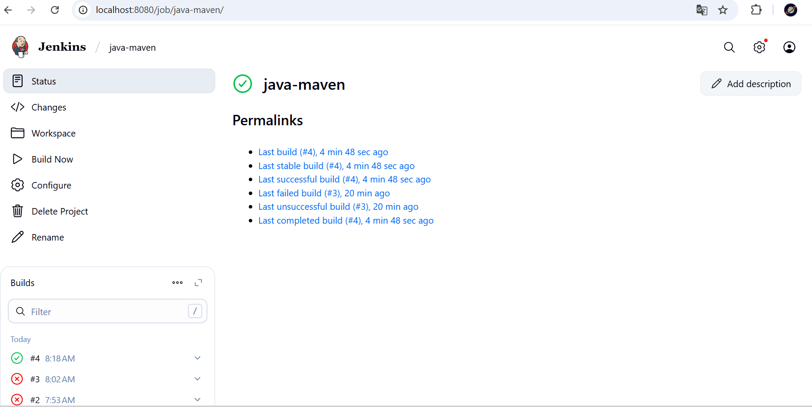

# Task 8 - Java Maven Project with Jenkins CI/CD

## 📌 Project Overview
This project demonstrates *Task 8* from my DevOps learning journey.  
It is a simple *Java program* built using *Apache Maven, integrated with **Jenkins* for continuous integration and automated build.

The pipeline compiles the Java source code, runs Maven build, and produces a JAR artifact.

---

## ⚙ Tech Stack
- *Java* (Core Java program)
- *Maven* (Build automation tool)
- *Jenkins* (CI/CD server)
- *Git & GitHub* (Version control)

---

## 📂 Project Structure

java-maven/ │── src/ │   └── main/ │       └── java/ │           └── hello.java      # Simple Java class │ │── pom.xml                     # Maven configuration │── README.md                   # Project documentation

---

## ▶ Steps to Run Locally

### ⿡ Clone the Repository
```bash
git clone https://github.com/<your-username>/java-maven.git
cd java-maven

⿢ Compile & Package with Maven

mvn clean install

This will generate a JAR file inside the target/ directory.

⿣ Run the Java Program

java -cp target/java-maven-1.0-SNAPSHOT.jar hello


---

🚀 Jenkins Pipeline Setup

1. Install Jenkins and configure Maven & JDK in Jenkins global tools.


2. Create a Freestyle project or Pipeline job in Jenkins.


3. Connect the project with this GitHub repository.


4. Configure Jenkins build steps:

Git Checkout

Maven Build (mvn clean install)

Post-build Actions (optional: archive artifacts)
### 1.  jenkins dashboard

### 1. successful build


---

✅ Expected Output

When the program runs successfully, it prints:

Hello, World from Java Maven Project!
